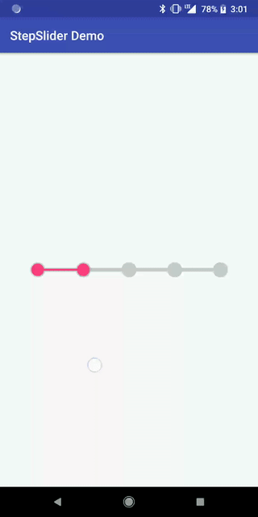

Android-StepSlider
============================

A simple slider that is discrete with intermediate steps



Usage
-----
```gradle
dependencies {
    compile 'com.github.bosphere:android-stepslider:1.0.1'
}
```

```xml
<com.bosphere.stepslider.StepSlider
    android:layout_width="match_parent"
    android:layout_height="match_parent"
    android:paddingLeft="48dp"
    android:paddingRight="48dp"
    app:ss_step="5"
    app:ss_thumb_radius="10dp"
    app:ss_thumb_bg_radius="12dp"
    app:ss_thumb_color="@color/colorPrimary"
    app:ss_thumb_bg_color="@color/colorControlNormal"
    app:ss_track_height="3dp"
    app:ss_track_bg_height="6dp"
    app:ss_track_color="@color/colorPrimary"
    app:ss_track_bg_color="@color/colorControlNormal"/>
```

```java
StepSlider slider = findViewById(R.id.slider);
slider.setOnSliderPositionChangeListener(new OnSliderPositionChangeListener() {
    @Override
    public void onPositionChanged(int position) {
        // catch user movement here
    }
});
```

Customization
-------------

| Property | XML Attribute | Java Method |
| -------- | ------------- | ----------- |
| Num of steps | `ss_step` | `setStepCount(int steps)` |
| Thumb size | `ss_thumb_radius` | `setThumbRadiusPx(int radiusPx)` |
| Thumb size (background) | `ss_thumb_bg_radius` | `setThumbBgRadiusPx(int radiusPx)` |
| Thumb color | `ss_thumb_color` | `setThumbColor(@ColorInt int color)` |
| Thumb color (background) | `ss_thumb_bg_color` | `setThumbBgColor(@ColorInt int color)` |
| Track height | `ss_track_height` | `setTrackHeightPx(int heightPx)` |
| Track height (background) | `ss_track_bg_height` | `setTrackBgHeightPx(int heightPx)` |
| Track color | `ss_track_color` | `setTrackColor(@ColorInt int color)` |
| Track color (background) | `ss_track_bg_color` | `setTrackBgColor(@ColorInt int color)` |


Compatibility
-------------

API 9 (Android 2.3) and up

License
-------

Copyright 2018 Yang Bo

Licensed under the Apache License, Version 2.0 (the "License");
you may not use this file except in compliance with the License.
You may obtain a copy of the License at

   http://www.apache.org/licenses/LICENSE-2.0

Unless required by applicable law or agreed to in writing, software
distributed under the License is distributed on an "AS IS" BASIS,
WITHOUT WARRANTIES OR CONDITIONS OF ANY KIND, either express or implied.
See the License for the specific language governing permissions and
limitations under the License.